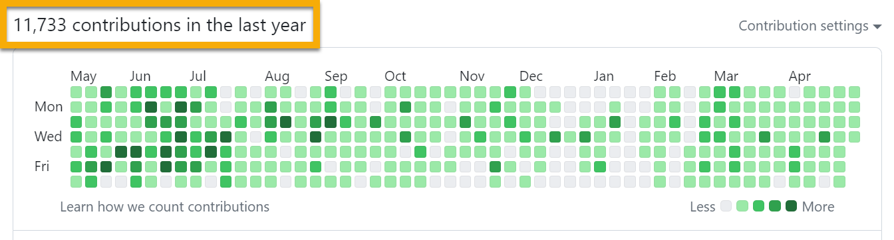

> Load, expand, and compose environment variables from a deterministic dotenv cascade, then execute commands under that context. Use `get-dotenv` as a library, a CLI, or a plugin-first host to build dotenv-aware tooling with cross‑platform shell control, CI‑friendly capture, and clear diagnostics.

# get-dotenv

[](https://www.npmjs.com/package/@karmaniverous/get-dotenv)
 <!-- TYPEDOC_EXCLUDE -->
[](https://docs.karmanivero.us/get-dotenv)
[](https://github.com/karmaniverous/get-dotenv/tree/main/CHANGELOG.md)<!-- /TYPEDOC_EXCLUDE -->
[](https://github.com/karmaniverous/get-dotenv/tree/main/LICENSE.md)

Load environment variables with a cascade of environment-aware dotenv files. You can:

✅ Asynchronously load environment variables from multiple dotenv files.

✅ Segregate variables into distinct files:

- Public files (e.g. `.env`, `.env.dev`, `.env.test`) are synced with your git repository.
- Private files (e.g. `.env.local`, `.env.dev.local`, `.env.test.local`) are protected by `.gitignore`.
- Global files (e.g. `.env`, `.env.local`) apply to all environments.
- Env files (e.g. `.env.dev`, `.env.dev.local`, `.env.test`, `.env.test.local`) apply to a specific environment.
- [Dynamic files](#dynamic-processing) (`.env.js`) export logic that dynamically & progressively generates new variables or overrides current ones.

✅ Dynamically specify which variables to load by type.

✅ Explicitly add variables to the loaded set.

✅ Extract the resulting variables to an object, `process.env`, a dotenv file, or a logger object, in any combination.

✅ Customize your dotenv file directories & naming patterns.

✅ Perform all of the above either programmatically or [from the command line](#command-line-interface), where you can also execute additional commands within the resulting context... including nested `getdotenv` commands that inherit the parent command's settings & context!

✅ [Execute batched CLI commands](#batch-command) across multiple working directories, with each command inheriting the `getdotenv` context.

✅ Set defaults for all options in a `getdotenv.config.json` file in your project root directory.

✅ Validate your final composed environment via config: JSON/YAML `requiredKeys` or a JS/TS Zod `schema`. Validation runs once after Phase C (interpolation). Use `--strict` to fail on issues; otherwise warnings are printed. See the [Config files and overlays](./guides/config.md) guide.

✅ Diagnostics for safer visibility without altering runtime values:

- Redaction at presentation time for secret-like keys (`--redact`, `--redact-pattern`).
- Entropy warnings (on by default) for high-entropy strings; gated by length/printability and tunable via `--entropy-*` flags. See [Config files and overlays](./guides/config.md).

✅ Clear tracing and CI-friendly capture:

- `--trace [keys...]` shows per-key origin (parent | dotenv | unset) before spawning.
- Set `GETDOTENV_STDIO=pipe` or use `--capture` to buffer child stdout/stderr deterministically. See [Shell execution behavior](./guides/shell.md).

✅ Cross-platform shells and normalized child environments: defaults to `/bin/bash` on POSIX and `powershell.exe` on Windows; subprocess env is composed once via a unified helper that drops undefineds and normalizes temp/home variables. See [Shell execution behavior](./guides/shell.md).

✅ [Generate an extensible `getdotenv`-based CLI](https://github.com/karmaniverous/get-dotenv-child) for use in your own projects.

`getdotenv` relies on the excellent [`dotenv`](https://www.npmjs.com/package/dotenv) parser and somewhat improves on [`dotenv-expand`](https://www.npmjs.com/package/dotenv-expand) for recursive variable expansion.

You can always use `getdotenv` directly on the command line, but its REAL power comes into play when you use it as the foundation of your own CLI. This lets you set defaults globally and configure pre- and post-hooks that mutate your `getdotenv` context and do useful things like grab an AWS session from your dev environment and add it to the command execution context.

When you plug your own [`commander`](https://www.npmjs.com/package/commander) CLI commands into the `getdotenv` base, they will execute within all of the environmental context created above!

## Requirements

- Node.js >= 20 (this repository pins 22.19.0 for CI/reproducibility)

## API Reference

Generated API documentation is hosted at:

- https://docs.karmanivero.us/get-dotenv

The site is built with TypeDoc from the source code in this repository.

## Testing

This project uses Vitest with the V8 coverage provider. Run:

```bash
npm run test
```

## Installation

```bash
npm install @karmaniverous/get-dotenv
```

## Scaffold

You can scaffold config files and a host-based CLI skeleton using the built-in init command. Templates are shipped with the package and copied verbatim.

Examples:

```bash
# JSON config + .local variant, and a CLI skeleton named "acme"
npx getdotenv init . \
  --config-format json \
  --with-local \
  --cli-name acme \
  --force
```

```bash
# TypeScript config with a dynamic example; CLI named "toolbox"
npx getdotenv init ./apps/toolbox \
  --config-format ts \
  --cli-name toolbox
```

Collision flow (when a destination file exists):

- Interactive prompt: [o]verwrite, [e]xample, [s]kip, or their “all” variants [O]/[E]/[S].
- Non-interactive detection: Treated as `--yes` (Skip All) unless `--force` is provided (Overwrite All). Considered non-interactive when stdin or stdout is not a TTY OR when a CI-like environment variable is present (`CI`, `GITHUB_ACTIONS`, `BUILDKITE`, `TEAMCITY_VERSION`, `TF_BUILD`).
- Precedence: `--force` > `--yes` > auto-detect (non-interactive => Skip All).
- Options overview:
  - `--config-format <json|yaml|js|ts>`
  - `--with-local` to generate `.local` alongside public config (JSON/YAML)
  - `--cli-name <string>` for token substitution (`__CLI_NAME__`) in the CLI skeleton
  - `--force` to overwrite all; `--yes` to skip all

Notes:

- Templates are shipped with the package and copied verbatim.
- The CLI skeleton replaces `__CLI_NAME__` tokens with your chosen name.

## Usage

```js
import { getDotenv } from '@karmaniverous/get-dotenv';

const dotenv = await getDotenv(options);
```

Options can be passed programmatically or set in a `getdotenv.config.json` file in your project root directory. The same file also sets default options for the `getdotenv` CLI or any child CLI you spawn from it.

See the [child CLI example repo](https://github.com/karmaniverous/get-dotenv-child#configuration) for an extensive discussion of the various config options and how & where to set them.

## CLI embedding (createCli)

Prefer the named factory when you want to embed the get‑dotenv CLI in your own tool. It wires the plugin‑first host with the included plugins and returns a small runner.

```ts
#!/usr/bin/env node
import { createCli } from '@karmaniverous/get-dotenv';

// Build a CLI and run with your argv; alias appears in help.
await createCli({
  alias: 'mycli',
  // Optional: override the help header (otherwise “mycli v<version>” is used).
  branding: 'mycli v1.2.3',
}).run(process.argv.slice(2));
```

Notes:

- The host resolves dotenv context once per invocation and exposes subcommands: cmd, batch, aws, and init (see Guides below).
- Use `--trace [keys...]` and `--redact` for diagnostics without altering runtime values.
- Default shells are normalized across platforms: `/bin/bash` on POSIX and `powershell.exe` on Windows (overridable per‑script or globally).
- Help/exit behavior (important for embedding and tests):
  - To keep `-h/--help` deterministic across ESM/CJS and avoid Commander’s default `process.exit`, `createCli().run(['-h'])` prints help and returns without exiting the process.
  - Because help is printed before the internal `brand()` call runs, the optional branding header may be omitted when `-h/--help` is used at the top level. If you need a branded header, prefer `mycli help` (which runs through normal parsing) or construct and brand a host directly (see “Branding the host CLI” in Guides).
- Interop matrix (embedding in different module systems):
  - ESM dynamic:
    ```ts
    const { createCli } = await import('@karmaniverous/get-dotenv');
    await createCli({ alias: 'mycli' }).run(['-h']);
    ```
  - CommonJS require (using built outputs for smoke checks):
    ```js
    const { createCli } = require('@karmaniverous/get-dotenv/dist/index.cjs');
    createCli({ alias: 'mycli' }).run(['-h']);
    ```

## Dynamic Processing

This package supports the full [`dotenv-expand`](https://www.npmjs.com/package/dotenv-expand) syntax, with some internal performance improvements. Dynamic variables can be authored in JS or TS.

Use the `dynamicPath` option to add a relative path to a Javascript module with a default export like this:

```js
export default {
  SOME_DYNAMIC_VARIABLE: (dotenv) => someLogic(dotenv),
  ANOTHER_DYNAMIC_VARIABLE: (dotenv) =>
    someOtherLogic(dotenv.SOME_DYNAMIC_VARIABLE),
  ONE_MORE_TIME: ({ DESTRUCTURED_VARIABLE, ANOTHER_DYNAMIC_VARIABLE }) =>
    DESTRUCTURED_VARIABLE + ANOTHER_DYNAMIC_VARIABLE,
};
```

If the value corresponding to a key is a function, it will be executed with the current state of `dotenv` as its single argument and the result applied back to the `dotenv` object. Otherwise, the value will just be applied back to `dotenv`. (Although if you're going to do that then you might as well just create a public global variable in the first place.)

Since keys will be evaluated progressively, each successive key function will have access to any previous ones. These keys can also override existing variables.

### TypeScript-first dynamic processing

You can write your dynamic module in TypeScript and point `dynamicPath` at a `.ts` file. Install [`esbuild`](https://esbuild.github.io/) as a dev dependency to enable automatic compilation:

```ts
// dynamic.ts
export default {
  MY_DYNAMIC: ({ APP_SETTING = '' }) => `${APP_SETTING}-ts`,
};
```

If `esbuild` is not installed and a direct import fails, `get-dotenv` attempts a simple fallback for single-file `.ts` modules without imports; otherwise it will throw with clear guidance to install `esbuild`.

Programmatic users can skip files entirely and pass dynamic variables directly:

```ts
import { getDotenv, defineDynamic } from '@karmaniverous/get-dotenv';

const dynamic = defineDynamic({
  MY_DYNAMIC(vars, env) {
    return `${vars.APP_SETTING}-${env ?? ''}`;
  },
});

const vars = await getDotenv({ dynamic, paths: ['./'], env: 'dev' });
```

Notes:

- Programmatic `dynamic` takes precedence over `dynamicPath` when both are provided.
- Dynamic keys are evaluated progressively, so later keys can reference earlier results.

#### Troubleshooting

- “Unknown file extension '.ts'” when loading `dynamic.ts`:
  - Install `esbuild` (`npm i -D esbuild`).

- “Unable to load dynamic TypeScript file …”:
  - Install `esbuild`. A simple transpile fallback exists only for trivial single-file modules; any imports in `dynamic.ts` require `esbuild` bundling.

## Command Line Interface

You can also use `getdotenv` from the command line:

```bash
> npx getdotenv -h

# Usage: getdotenv [options] [command]
#
# Base CLI.
#
# Options:
#   -e, --env <string>                  target environment (dotenv-expanded)
#   -v, --vars <string>                 extra variables expressed as delimited key-value pairs (dotenv-expanded): KEY1=VAL1 KEY2=VAL2
#   -o, --output-path <string>          consolidated output file  (dotenv-expanded)
#   -s, --shell [string]                command execution shell, no argument for default OS shell or provide shell string (default OS shell)
#   -S, --shell-off                     command execution shell OFF
#   -p, --load-process                  load variables to process.env ON (default)
#   -P, --load-process-off              load variables to process.env OFF
#   -a, --exclude-all                   exclude all dotenv variables from loading ON
#   -A, --exclude-all-off               exclude all dotenv variables from loading OFF (default)
#   -z, --exclude-dynamic               exclude dynamic dotenv variables from loading ON
#   -Z, --exclude-dynamic-off           exclude dynamic dotenv variables from loading OFF (default)
#   -n, --exclude-env                   exclude environment-specific dotenv variables from loading
#   -N, --exclude-env-off               exclude environment-specific dotenv variables from loading OFF (default)
#   -g, --exclude-global                exclude global dotenv variables from loading ON
#   -G, --exclude-global-off            exclude global dotenv variables from loading OFF (default)
#   -r, --exclude-private               exclude private dotenv variables from loading ON
#   -R, --exclude-private-off           exclude private dotenv variables from loading OFF (default)
#   -u, --exclude-public                exclude public dotenv variables from loading ON
#   -U, --exclude-public-off            exclude public dotenv variables from loading OFF (default)
#   -l, --log                           console log loaded variables ON
#   -L, --log-off                       console log loaded variables OFF (default)
#   -d, --debug                         debug mode ON
#   -D, --debug-off                     debug mode OFF (default)
#   --default-env <string>              default target environment
#   --dotenv-token <string>             dotenv-expanded token indicating a dotenv file (default: ".env")
#   --dynamic-path <string>             dynamic variables path (.js or .ts; .ts is auto-compiled when esbuild is available, otherwise precompile)
#   --paths <string>                    dotenv-expanded delimited list of paths to dotenv directory (default: "./")
#   --paths-delimiter <string>          paths delimiter string (default: " ")
#   --paths-delimiter-pattern <string>  paths delimiter regex pattern
#   --private-token <string>            dotenv-expanded token indicating private variables (default: "local")
#   --vars-delimiter <string>           vars delimiter string (default: " ")
#   --vars-delimiter-pattern <string>   vars delimiter regex pattern
#   --vars-assignor <string>            vars assignment operator string (default: "=")
#   --vars-assignor-pattern <string>    vars assignment operator regex pattern
#   -h, --help                          display help for command
#
# Commands:
#   batch [options]                     Batch shell commands across multiple working directories.
#   cmd                                 Execute command according to the --shell option, conflicts with --command option (default command)
#   help [command]                      display help for command
```

### Default shell behavior

To normalize behavior across platforms, the CLI resolves a default shell when `--shell` is true or omitted:

- POSIX: `/bin/bash`
- Windows: `powershell.exe`

### Batch Command

The `getdotenv` base CLI includes one very useful subcommand: `batch`.

This command lets you execute a shell command across multiple working directories. Executions occur within the loaded `dotenv` context. Might not be relevant to your specific use case, but when you need it, it's a game-changer!

My most common use case for this command is a microservice project where release day finds me updating dependencies & performing a release in well over a dozen very similar repositories. The sequence of steps in each case is exactly the same, but I need to respond individually as issues arise, so scripting the whole thing out would fail more often than it would work.

I use the `batch` command to perform each step across all repositories at once. Once you get used to it, it feels like a superpower!

Lest you doubt what that kind of leverage can do for you, consider this:

[](https://github.com/karmaniverous)

```bash
> getdotenv batch -h

# Usage: getdotenv batch [options] [command]
#
# Batch command execution across multiple working directories.
#
# Options:
#   -p, --pkg-cwd             use nearest package directory as current working directory
#   -r, --root-path <string>  path to batch root directory from current working directory (default: "./")
#   -g, --globs <string>      space-delimited globs from root path (default: "*")
#   -c, --command <string>    command executed according to the base --shell option, conflicts with cmd subcommand (dotenv-expanded)
#   -l, --list                list working directories without executing command
#   -e, --ignore-errors       ignore errors and continue with next path
#   -h, --help                display help for command
#
# Commands:
#   cmd                       execute command, conflicts with --command option (default subcommand)
#   help [command]            display help for command
```

Note that `batch` executes its commands in sequence, rather than in parallel!

To understand why, imagine running `npm install` in a dozen repos from the same command line. The visual feedback would be impossible to follow, and if something broke you'd have a really hard time figuring out why.

Instead, everything runs in sequence, and you get a clear record of exactly what happened and where. Also worth noting that many complex processes are resource hogs: you would not _want_ to run a dozen Serverless deployments at once!

Meanwhile, [this issue](https://github.com/karmaniverous/get-dotenv/issues/7) documents the parallel-processing option requirement. Feel free to submit a PR!

---

### Authoring npm scripts and the `-c`/`--cmd` alias

When you run commands via `npm run`, flags after `--` are forwarded to your script and may be applied to the inner shell command instead of `getdotenv` unless you structure your script carefully.

- Anti-pattern:

  ```json
  { "scripts": { "script": "getdotenv echo $APP_SETTING" } }
  ```

  Then `npm run script -- -e dev` applies `-e` to `echo`, not to `getdotenv`.

- Recommended:
  ```json
  { "scripts": { "script": "getdotenv -c 'echo $APP_SETTING'" } }
  ```
  Now `npm run script -- -e dev` applies `-e` to `getdotenv`, which loads and expands variables before executing the inner command.

Notes:

- `-c`/`--cmd` is an alias of the `cmd` subcommand; do not use both in a single invocation.
- On POSIX shells, prefer single quotes to prevent the outer shell from expanding `$VAR` before Node sees it. On PowerShell, single quotes are also literal.
- Script-level shell overrides (`scripts[name].shell`) still take precedence over the global `--shell`.

Important:

- When using the parent alias `--cmd` with a Node eval payload, quote the entire payload as a single token so Commander does not treat `-e/--eval` as getdotenv’s `-e, --env` flag.
  - POSIX example:
    ```
    getdotenv --cmd 'node -e "console.log(process.env.APP_SETTING ?? \"\")"'
    ```
  - PowerShell example (single quotes are literal in PowerShell):
    ```
    getdotenv --cmd 'node -e "console.log(process.env.APP_SETTING ?? \"\")"'
    ```
- If you do not need to pass additional parent flags after the command, you can prefer the subcommand form instead:
  ```
  getdotenv --shell-off cmd node -e "console.log(process.env.APP_SETTING ?? '')"
  ```

Diagnostics and CI capture:

- To capture child stdout/stderr deterministically (e.g., in CI), either set the environment variable `GETDOTENV_STDIO=pipe` or pass `--capture`. Outputs are buffered and re-emitted after completion.
- For debugging environment composition, use:
  ```
  getdotenv --trace [keys...] cmd node -e "0"
  ```
  When provided without keys, `--trace` emits a concise origin line for every key (parent | dotenv | unset) to stderr before the child process launches.

---

## Guides

- [Cascade and precedence](./guides/cascade.md) - How variables load and merge across
  paths and public/private/env axes.
- [Shell execution behavior](./guides/shell.md) - How commands run cross‑platform;
  quoting rules, default shells, and capture tips.
- [Config files and overlays](./guides/config.md) - Author JSON/YAML/JS/TS config and
  apply privacy/source overlays (always‑on).
- [Authoring Plugins](./guides/authoring/index.md) - Compose CLIs with once‑per‑invoke dotenv context and plugin lifecycles.
- [Shipped Plugins](./guides/shipped/index.md) - The get‑dotenv host ships a small set of plugins that cover needs.
- [Generated CLI](./guides/generated-cli.md) - Deprecated in favor of plugin-first host. A thin, fixed command surface powered by get‑dotenv; when and how to use it.

The guides are also included in the [hosted API docs](https://docs.karmanivero.us/get-dotenv).

## Generated CLI

This package still supports generating a standalone CLI for your projects. For most use cases we recommend the new plugin-first host because it resolves dotenv context once per invocation, supports composable plugins, and provides better subprocess control and diagnostics. If you prefer a thin, fixed command surface with defaults baked into config, the generated CLI can be a good fit.

See the [Generated CLI guide](https://docs.karmanivero.us/get-dotenv/guides/generated-cli) for details

---

See more great templates & tools on [my GitHub Profile](https://github.com/karmaniverous)!
